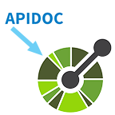

# Apidoc to Openapi Converter &nbsp; [](https://github.com/grahammthomas/apidoc_to_openapi)

[Apidoc](http://apidocjs.com/) syntax is very easy and lightweight, whereas [Openapi aka Swagger](https://swagger.io/docs/specification/about/) syntax is very verbose and not noob friendly. The goal of this project is to make documenting api endpoints so easy that developers won't mind spending the time to do it, instead of just ignoring documentation.

## Apidoc conversion coverage

Convertable Annotations:

```
@api
@apiName
@apiGroup
@apiParam
@apiSuccess
```

Feel free to PR in any other annotations you need.

### Installing

```
pip install apidoc-to-openapi
```

```
usage: apidoc_to_openapi [-h] -i path [-o path] [--yaml]

optional arguments:
  -h, --help  show this help message and exit
  -o path     File output (default: stdout)
  --yaml      Convert output to yaml format

Required:
  -i path     File or directory containing apidoc annotations
```

#### Example

```
apidoc-to-openapi -i ./my/path/ -o ./my/path/swagger.yaml --yaml
```

## Running the tests

Used pytest for testing. Test coverage isn't near where I want it to be.

## Coding Style

Using black formatter and pylint

## Authors

- **Graham Thomas** - _Initial work_

## License

This project is licensed under the MIT License - see the [LICENSE.md](LICENSE.md) file for details

## Acknowledgments

- I have no friends
